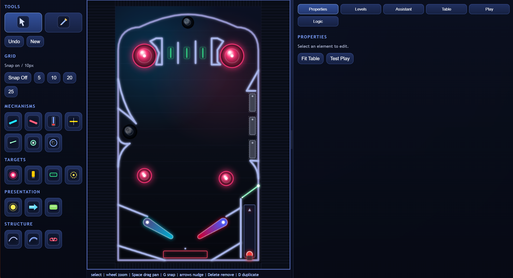
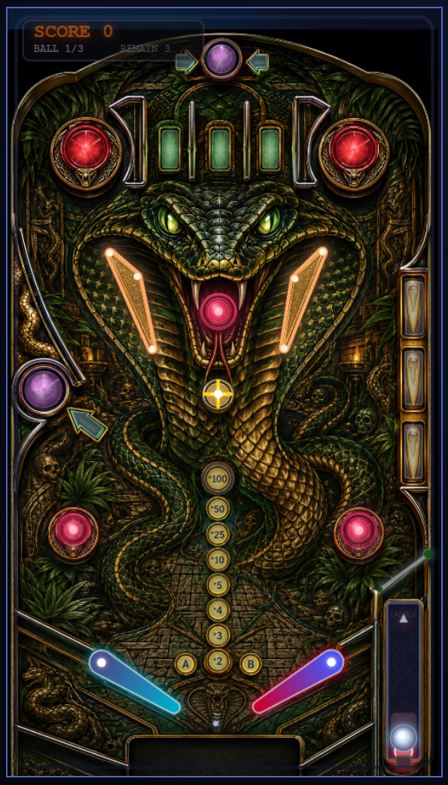

# Pinball

Pinball is a static browser pinball project built as a "vibe code" exploration: using Codex to iteratively design, implement, critique, and simplify a bespoke application while keeping the result usable as software.

The app is both a small pinball game and a design laboratory. It explores:
- how far an AI-assisted coding loop can take a custom browser game without a framework or build step
- how an in-app assistant can help design table geometry and gameplay rules
- how to make complex state-machine authoring understandable for humans
- where AI-generated implementation helps, where it adds cruft, and where the code needs pruning

## What It Is

The project has three main browser surfaces:

- `#play`: playable pinball mode with canvas rendering, physics, scoring, high scores, keyboard controls, and touch controls.
- `#design`: visual table editor for playfield objects, mechanisms, lamps, images, levels, and assistant-assisted table edits.
- `#logic`: logic-only authoring workspace for switches, state, computed values, lamp bindings, rules, resets, validation, and simulation.

`#logicstudio` is currently an alias for `#logic`.

The current design direction is intentionally current-schema only. Old table compatibility and previous `rulesEngine` compatibility paths have been removed. New table logic lives directly in `table.logicDocument`.

## Designer Screen

The design mode is the main human-facing table workshop. It gives a designer:

- a canvas-centered table view with zoom, pan, grid snapping, and selection handles
- palette groups for mechanisms, targets, presentation elements, and structure
- element property panels for precise edits
- level controls for layered table design
- an assistant panel for AI-assisted table and logic patching
- quick handoff into play mode for rapid testing



The screenshot collateral for the project shows this mode: a table canvas in the center, tool palette on the left, and properties/logic/assistant/play panels on the right. That screen is the clearest representation of the project goal: not just a toy game, but a designer-facing environment for building and reasoning about pinball machines.

## Table View



## Logic Design Experiment

The `#logic` workspace is a core research part of the project. The question is not only "can we make rules work?" but "can we make a complex state system manageable for a human designer?"

The current logic model is feature-first:

- `table.features[]` describes gameplay concepts in human terms.
- `table.logicDocument` contains the executable logic source.
- `switchRegistry` maps physical table objects and timers to named logical switches.
- `stateTable` stores authored state.
- `computedState` derives read-only state from expressions.
- `lampBindings` connect logic state to lamps.
- `actionRules` respond to switches and apply effects.
- `resetRules` clear state on events such as drain or collect.

The logic editor includes validation and pure logic simulation so a designer can test state transitions before launching the physics game. This is deliberately separated from table geometry editing because complex state-machine interfaces quickly become unusable when everything is shown at once.

## Physics Lab And Table Evaluation

`physics-lab.html` is the physics and table-evaluation workbench. It started as a tuning surface for small flipper scenarios and has grown into the beginning of a table validity harness.

The intent is deliberately narrow: this is not trying to decide whether a table is fun, beautiful, or commercially good. It is trying to answer whether a table is structurally and physically valid enough to be worth playing and iterating on.

The lab currently supports:

- loading bundled table JSON from the table catalog
- loading that table into the sandbox for visual inspection and manual play
- running table evaluation checks with PASS / WARN / FAIL output
- showing JSON-style report data that an agent or later tool can consume
- clicking evaluation rows to draw diagnostics on the table canvas
- tracing launcher rollout/stuck diagnostics through the same core physics path used by play mode
- `AI-Lab` visibility-first patch/eval workflow:
  - stepwise attempts with explicit operator approval
  - optional auto/batch toggles with guardrails
  - provider status panel (configured/missing/reachable/unreachable) with manual `Check Provider` probe
  - attempt timeline, structured failure detail, and checkpoint/rollback controls
  - desktop tabbed workflow (`Tune`, `Sandbox`, `Eval`, `AI-Lab`) to keep control depth shallow
  - right-side inspector for heavy JSON/detail panes so control tabs stay compact
  - throttled metrics UI refresh and hidden-tab frame short-circuiting to reduce background UI cost
  - optional top-bar perf readout (`Perf On`) and paused-state dirty-render gating to reduce idle redraw overhead

The important design rule is that evaluation and fine-tuning data should come from the real model wherever possible. The lab must not grow a separate "almost physics" model just because it is easier to inspect. If an evaluation involves launcher behavior, gates, flippers, drains, or collisions, it should use the same compiled elements and `Pin.physics.stepWorld` path as the game runtime. Approximate overlays are acceptable for explanation, but not as the source of truth for pass/fail behavior.

This matters because table validation is meant to guide edits. If a diagnostic disagrees with play mode, the diagnostic is the thing to fix. As with the rest of the project, it is what it is: an experimental harness, useful only insofar as it stays tied to the real runtime behavior.

## AI Integration

The project has two AI-related layers:

- The codebase itself is being built and refactored through Codex-assisted iteration.
- The application includes an assistant workflow intended to generate structured patches for table and logic edits.

The assistant contract is intentionally constrained. It should produce JSON patch objects with known keys such as:

- `tablePatch`
- `addElements`
- `patchElements`
- `removeElements`
- `addFeatures`
- `patchFeatures`
- `removeFeatures`
- `logicDocPatch`

The app validates and previews patches before applying them. The design goal is to make AI useful inside the product without letting it freely mutate arbitrary application state.

In this static build, provider settings and assistant UI are local/browser-side. External AI execution depends on configured provider endpoints.

In Physics Lab `AI-Lab`, provider status is shown directly in the panel:

- `missing ...`: one or more required fields are absent in `pin.assistant.settings` (`baseUrl`, `apiKey`, `model`)
- `configured ...`: required fields exist locally
- `reachable ...`: a live probe to the provider `/models` endpoint succeeded
- `configured but unreachable ...`: settings exist but endpoint probe failed (HTTP/CORS/network/auth/etc.)

The `Check Provider` button triggers the live probe. Opening the `AI-Lab` tab also performs a lightweight refresh and periodic probe.

The project also includes a Node `eval-agent` loop for automation and dataset building. It shares the same patch/eval contract used by browser AI-Lab so interactive and batch workflows stay aligned.

## Current Table Schema

Current `version: 1` tables are centered on:

- `name`
- `playfield`
- `rules`
- `levels`
- `features`
- `images`
- `elements`
- `logicDocument`

Supported element families include:

- `flipper`
- `launcher`
- `path`
- `lane`
- `dropTarget`
- `spinner`
- `gate`
- `kicker`
- `bumper`
- `scoreZone`
- `drain`
- `trough`
- `light`
- `arrowLight`
- `boxLight`
- `ramp`

See `TBSpec.MD` for the stricter assistant and logic authoring contract.

## Runtime Architecture

This is a no-build browser app. `index.html` loads plain JavaScript modules in dependency order.

Important modules:

- `app/main.js`: route parsing, table loading, play-mode bootstrap, game loop
- `app/physics.js`: ball integration, collisions, broad phase, sensors, launcher behavior
- `app/render.js`: canvas rendering, static render cache, quality scaling
- `app/elements/*`: element compile/draw/runtime behavior
- `app/physicsHarness.js`: deterministic physics scenarios and sandbox simulation used by the lab
- `app/aiLabContract.js`: shared AI patch contract, patch apply/validate flow, and evaluator entry
- `app/tableEval.js`: table evaluation checks, diagnostics, and report generation
- `app/tuning/lab.js`: browser UI for physics tuning, sandbox play, and table evaluation
- `app/editor/*`: design mode, palettes, selection, hit testing, panels, assistant integration
- `app/logic/*`: logic schema, validation, simulation, assets, and logic UI
- `app/table.js`: table defaults, normalization, validation, playability checks
- `app/storage.js`: local/file/hash storage helpers
- `tests/smoke.test.js`: no-build regression checks

The play runtime separates static table geometry from dynamic physics mechanisms. Static rendering is cached, while dynamic physics only recompiles collider-producing elements such as flippers, gates, spinners, and the launcher.

## Running Locally

The app can be opened directly, but hosted mode is better because table JSON and image loading use browser fetch behavior.

From the repo root:

```bash
python -m http.server 8000 --bind 127.0.0.1
```

Then open:

```text
http://127.0.0.1:8000/index.html
```

Useful routes:

```text
http://127.0.0.1:8000/index.html#play
http://127.0.0.1:8000/index.html#design
http://127.0.0.1:8000/index.html#logic
http://127.0.0.1:8000/index.html#play&table=Egypt
http://127.0.0.1:8000/index.html?table=mtpb#play
```

## Testing

Run the smoke suite:

```bash
npm test
```

The tests check script ordering, table validation, bundled image paths, assistant patch behavior, logic simulation, high scores, runtime split behavior, and eval-agent contract/evaluation smoke behavior.

## Eval-Agent CLI

The repo includes an automation CLI for patch validation and dataset generation:

```bash
npm run eval-agent -- validate-patch --table tables/Cobra.json --patch my-patch.json --out result.json --dataset data/eval-runs/records.jsonl
```

```bash
npm run eval-agent -- provider-loop --table tables/Cobra.json --prompt "Improve table validity while preserving behavior." --max-steps 4 --dataset data/eval-runs/records.jsonl
```

Primary provider environment (OpenAI-compatible endpoint):

- `PIN_AI_BASE_URL`
- `PIN_AI_API_KEY`
- `PIN_AI_MODEL`

Optional review/scoring provider:

- `PIN_AI_REVIEW_BASE_URL`
- `PIN_AI_REVIEW_API_KEY`
- `PIN_AI_REVIEW_MODEL`

The CLI emits machine-readable JSON output. Dataset rows include contract issues, validation issues, eval summary/check failures, acceptance flag, and runtime metadata so generated examples can be filtered for fine-tuning workflows.

### Environment setup and secret hygiene

- Copy `.env.example` to `.env` and fill in real provider values for local use.
- `.env` and `.env.*` are git-ignored; `.env.example` stays committed as the template.
- Do not place real keys in table JSON, patch JSON, or committed docs.

PowerShell session example (no file loader required):

```powershell
$env:PIN_AI_BASE_URL="https://api.openai.com/v1"
$env:PIN_AI_API_KEY="sk-..."
$env:PIN_AI_MODEL="gpt-4.1"
npm run eval-agent -- provider-loop --table tables/Cobra.json --prompt "Improve table validity while preserving behavior." --max-steps 4 --dataset data/eval-runs/records.jsonl
```

## Performance Notes

A simple pinball game should run acceptably on modest hardware. Recent cleanup work focused on:

- avoiding full dynamic runtime rebuilds for render-only elements
- keeping static canvas rendering cached
- reducing allocations in collision hot paths
- removing old compatibility branches and backup/reference code
- keeping current table data on one schema

For browser-side profiling, set:

```js
localStorage.setItem("pin.perf", "1")
```

Then reload play mode and watch console output for timing summaries.

## Table JSON And Assets

Hosted table URL examples:

```text
index.html#play&table=Egypt
index.html#play&table=mtpb
index.html?table=Egypt#play
```

Image path rules for hosted table JSON:

- absolute URLs and root paths are used as written
- `tables/...` paths are app-relative
- other relative paths resolve relative to the loaded table JSON URL directory

## Project Status

This is an active experimental codebase, not a polished engine. The goal is to keep the application useful while learning from the AI-assisted development process.

Current priorities:

- keep the schema current and remove dead compatibility paths
- make the designer and logic interfaces understandable for humans
- use AI patching where structured validation can keep it bounded
- preserve a fast play loop on older PCs
- prefer surgical, simple code over speculative framework-style abstractions
