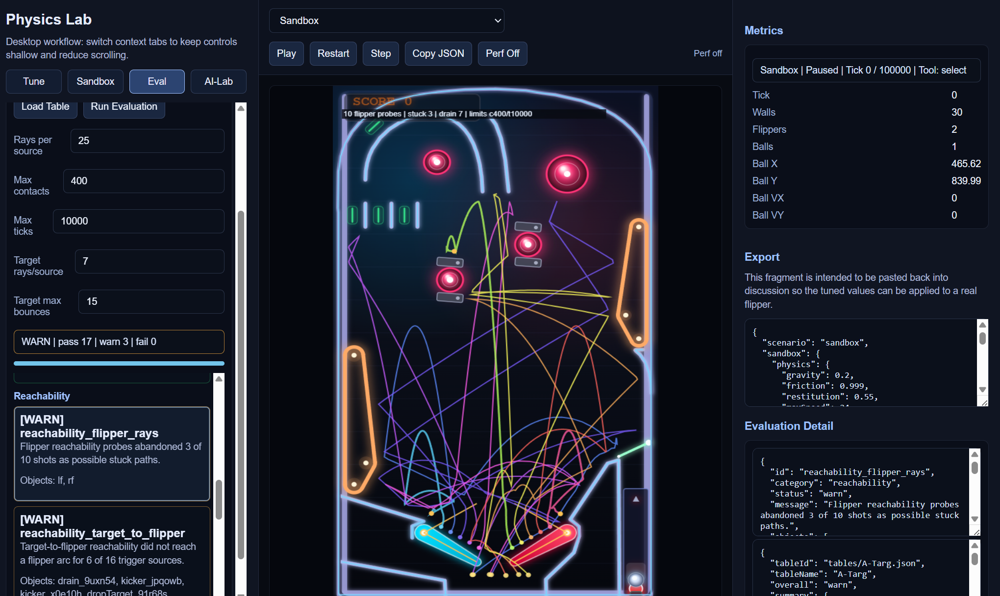

# Pinball

Pinball is a work-in-progress browser experiment. It is not a finished game, not a polished editor, and not a production engine. It is intentionally small: plain JavaScript, JSON table data, canvas rendering, no build step.

The useful part is not only that it is pinball. The useful part is the combination of:

- a deterministic-ish physics simulation
- structured table data in JSON
- an interactive editor
- a physics lab and evaluator
- a short browser feedback loop

That makes it a good sandbox for testing how AI-assisted development behaves on something more like a real task than a toy prompt. Pinball has geometry, timing, state, visual feedback, authored rules, and enough edge cases to punish vague instructions. LLMs do not understand what makes a table playable, let alone good. But they can still help with many bounded parts of the work: generating structured edits, wiring rules, proposing layouts, writing diagnostics, and producing code that humans then inspect, test, and cut back down to size.

This repo is an experiment in that workflow. It asks:

- Can an AI assistant modify structured game data without freely mutating the app?
- Can deterministic simulation make AI-generated changes easier to evaluate?
- Can a simple editor turn "add three targets and score them" into auditable JSON changes?
- Can automated checks catch some bad tables before a human wastes time playing them?
- Where does AI help, and where does it create extra cleanup work?

There are no claims here about completeness, correctness, or research-grade simulation. It is useful because it is inspectable, hackable, and repeatable enough to learn from.

## What You Can Do Today

- Play a bundled table in the browser.
- Edit table geometry and element properties in `#design`.
- Define game logic using structured data: switches, state, computed values, lamp bindings, action rules, and reset rules.
- Use the editor assistant to propose structured table/logic patches, then preview and validate them before applying.
- Open `physics-lab.html`, load a table, run evaluation checks, and inspect overlays.
- Run autoplay in the lab to launch balls, operate flippers, record ball traces, build heatmaps, and collect score summaries.
- Use `eval-agent` from Node to validate patches and collect machine-readable evaluation records.

What you cannot do today:

- Automatically prove that a table is fun or well designed.
- Train a flipper controller in this repo.
- Run a complete generate/evaluate/refine loop without human review.
- Treat the physics as physically accurate pinball.
- Rely on the AI assistant to understand playability by itself.

## What It Is

The project has three main browser surfaces:

- `#play`: playable pinball mode with canvas rendering, physics, scoring, high scores, keyboard controls, and touch controls.
- `#design`: visual table editor for playfield objects, mechanisms, lamps, images, levels, and assistant-assisted table edits.
- `#logic`: logic-only authoring workspace for switches, state, computed values, lamp bindings, rules, resets, validation, and simulation.

`#logicstudio` is currently an alias for `#logic`.

The current design direction is intentionally current-schema only. Old table compatibility and previous `rulesEngine` compatibility paths have been removed. New table logic lives directly in `table.logicDocument`.

The system is deliberately structured. Tables are JSON documents rather than opaque assets. Game rules are defined using structured data: sequence rules, switch triggers, variables, computed state, lamp bindings, and reset rules. Those rules are executed after each physics tick through the same event path used by play mode. That structure is what makes the project usable for AI-assisted editing and automated evaluation; the model is not guessing against a screenshot alone.

## Engineering Standards

This repo is not trying to prove that generated code should remain untouched. It is trying to prove that AI-assisted development becomes much more useful once the humans insist on standards.

Current engineering posture:

- comment code like the next reader will be tired, busy, and slightly suspicious
- prefer explicit contracts, validation, and named rules over "the model probably meant this"
- keep one current schema instead of dragging old compatibility branches around forever
- use AI where it is bounded by structure, preview, validation, and deterministic helpers
- keep physics, diagnostics, and evaluation tied to the real runtime rather than a friendlier fake
- choose simple code over clever compression; "shorter" is not a quality metric by itself

The house style is not anti-snark, only anti-hand-waving. If a comment, test, or prompt can say the precise thing with a bit of bite, that is acceptable. If it tries to substitute attitude for clarity, it is not.

## Agent Harness Research

Pinball is also useful as shared code collateral for comparing AI coding tools. The same base version can be presented to different agents, prompts, harnesses, and orchestration layers, then judged by how they handle the same requested change: what they inspect, what they break, what they test, and whether they can explain the result without pretending the diff is magic.

That works because the project gives AI systems a small but concrete world to interact with. There is table JSON, schema validation, logic simulation, physics stepping, canvas-visible behavior, smoke tests, eval-agent scoring, and prompt-evaluation tooling. This is not a benchmark in the formal sense. It is a practical test bed: repeatable enough to compare behavior, complex enough to expose weak orchestration, and small enough that the whole system remains understandable.

## Designer Screen

The design mode is the main human-facing table workshop. It gives a designer:

- a canvas-centered table view with zoom, pan, grid snapping, and selection handles
- palette groups for mechanisms, targets, presentation elements, and structure
- element property panels for precise edits
- level controls for layered table design
- an assistant panel for AI-assisted table and logic patching
- quick handoff into play mode for rapid testing


The screenshot collateral for the project shows this mode: a table canvas in the center, tool palette on the left, and properties/logic/assistant/play panels on the right. That screen is the clearest representation of the project goal: not just a toy game, but a designer-facing environment for building and reasoning about pinball machines.

## Table View


## Logic Design Experiment

The `#logic` workspace is a core research part of the project. The question is not only "can we make rules work?" but "can we make a complex state system manageable for a human designer?"

The current logic model is feature-first:

- `table.features[]` describes gameplay concepts in human terms.
- `table.logicDocument` contains the executable logic source.
- `switchRegistry` maps physical table objects and timers to named logical switches.
- `stateTable` stores authored state.
- `computedState` derives read-only state from expressions.
- `lampBindings` connect logic state to lamps.
- `actionRules` respond to switches and apply effects.
- `resetRules` clear state on events such as drain or collect.

The logic editor includes validation and pure logic simulation so a designer can test state transitions before launching the physics game. This is deliberately separated from table geometry editing because complex state-machine interfaces quickly become unusable when everything is shown at once.

## Physics Lab And Table Evaluation

`physics-lab.html` is the physics and table-evaluation workbench. It is a controlled environment for testing table behavior with repeatable scenarios and visible diagnostics.

The intent is deliberately narrow. The lab does not decide whether a table is fun, beautiful, or commercially good. It answers smaller questions: can the launcher release a ball, do probes get stuck, can the ball reach useful areas, does autoplay score anything, and what path did the ball actually take?



The Physics Lab screenshot shows the current evaluation workflow: table controls on the left, the live table sandbox in the center, and metrics/export/detail panes on the right. Evaluation checks produce PASS / WARN / FAIL rows; selecting a row draws the related diagnostic overlay on the table. In the shown reachability case, colored probe paths represent simulated ball trajectories from the real physics path, with warnings recorded when probes appear stuck, fail to drain, or do not reach a configured flipper/target condition within the selected limits.

Designer handoff:

- In `#design`, use the `Lab` button in the top tab bar to open `physics-lab.html#sandbox`.
- The current designer table is written to a one-shot localStorage handoff payload (`pin.physicsLab.handoff`) and consumed by Physics Lab on load.
- On conflict, the Designer handoff table is preferred over prior lab state.
- Physics Lab top-bar navigation (`Selector`, `Play`, `Design`, `Logic`) writes current lab table state to `autosave` before route change so the main app surfaces reopen on the same table context.

The lab currently supports:

- loading bundled table JSON from the table catalog
- loading that table into the sandbox for visual inspection and manual play
- running table evaluation checks with PASS / WARN / FAIL output
- showing JSON-style report data that an agent or later tool can consume
- clicking evaluation rows to draw diagnostics on the table canvas
- tracing launcher rollout/stuck diagnostics through the same core physics path used by play mode
- configuring probe counts, bounce/contact limits, and tick limits for repeatable AI Eval runs
- running lab-only autoplay with launcher variation, flipper control, ball trails, heatmaps, target aiming diagnostics, per-target hit counts, and score summaries
- `AI-Lab` visibility-first patch/eval workflow:
  - stepwise attempts with explicit operator approval
  - optional auto/batch toggles with guardrails
  - provider status panel (configured/missing/reachable/unreachable) with manual `Check Provider` probe
  - attempt timeline, structured failure detail, and checkpoint/rollback controls
  - desktop tabbed workflow (`Tune`, `Sandbox`, `Eval`, `AI-Lab`) to keep control depth shallow
  - right-side inspector for heavy JSON/detail panes so control tabs stay compact
  - throttled metrics UI refresh and hidden-tab frame short-circuiting to reduce background UI cost
  - optional top-bar perf readout (`Perf On`) and paused-state dirty-render gating to reduce idle redraw overhead

The important design rule is that evaluation and fine-tuning data should come from the real model wherever possible. The lab must not grow a separate "almost physics" model just because it is easier to inspect. If an evaluation involves launcher behavior, gates, flippers, drains, or collisions, it should use the same compiled elements and `Pin.physics.stepWorld` path as the game runtime. Approximate overlays are acceptable for explanation, but not as the source of truth for pass/fail behavior.

This matters because table validation is meant to guide edits. If a diagnostic disagrees with play mode, the diagnostic is the thing to fix. As with the rest of the project, it is what it is: an experimental harness, useful only insofar as it stays tied to the real runtime behavior.

### Autoplay Evaluation

Autoplay is a lab/eval feature, not part of normal game mode. It launches balls using the real launcher, steps the same physics runtime as play mode, runs table events and scoring rules, and operates flippers through a simple controller.

The current controller is intentionally modest:

- it varies launch hold time across multiple balls
- it chooses switch-backed targets, preferring unlit lanes/drop targets while those remain available
- when primary targets are already lit, it can prefer active collectable shots such as logic-armed troughs
- it predicts short flipper pulse candidates outside the main game loop
- it schedules bounded flipper pulses rather than holding flippers indefinitely
- it records ball traces, heatmap data, target diagnostics, event-based target-hit counts, and score summaries

Target selection uses the table's structured state rather than a separate strategy model. Lamp state is used to tell whether lane/drop-target style targets are lit. Runtime element properties are used to notice when collectable mechanisms become active; for example, a trough whose `active` property is driven by rules can become the preferred shot after the normal group targets are complete.

Target-hit tracking is based on processed `switchClosed` events, not just distance from the ball to the current aim point. Autoplay summaries include the total target-hit count and a per-target map (`summary.targetHitMap`) so a run can show which lanes, targets, troughs, or other switch-backed elements were actually activated.

Autoplay is useful for rough evaluation:

- "Does a single launched ball score at least 1,000 points?"
- "Do repeated launches cover the upper playfield?"
- "Does the ball keep falling into the same dead area?"
- "Do unlit targets receive any traffic?"

It is not a good player. It does not understand table strategy, table quality, combo design, or long-term mode value. The flipper controller is deliberately simple so more expensive prediction or learned controllers can be tried later without changing game mode performance.

The lab also has an experimental neural autoplay path. It trains a small browser-side policy from heuristic autoplay samples, shows the live sample buffer and class balance, and can switch live control between heuristic and neural modes without resetting the ball. This is useful for exploring whether a tiny controller can imitate or assist the heuristic. It is not a full learning system, does not train from score reward, and currently still relies on the heuristic path for fallback and target context.

For a single-ball score check in the lab, set:

- `Autoplay balls` to `1`
- `Autoplay min score` to the required score
- run `Autoplay Heatmap`

The evaluator reports PASS/WARN against the best-ball score when `Autoplay min score` is greater than zero. A pass means the current controller managed to score enough in that run. It does not prove that the table is generally playable.

## AI Integration

The project has several AI-adjacent pieces. They are related, but they are not the same thing:

- AI-assisted coding of this repo.
- The in-browser assistant that proposes structured table and logic patches.
- Automated evaluation checks that produce diagnostics and metrics.
- Node automation via `eval-agent`.
- Prompt-evaluation tooling.

The in-browser assistant is a tool inside the editor. It helps generate or modify structured data. It is not autonomous, and it does not understand playability. It can be useful because the table format is small enough and structured enough that proposed changes can be validated, previewed, and rejected.

Example requests that fit the current assistant model:

- "Add a lane and connect it to a scoring rule."
- "Trigger multiball after hitting three drop targets."
- "Add lights that show sequence progress."
- "Move these targets into a simple arc."

The assistant contract is intentionally constrained. It should produce JSON patch objects with known keys such as:

- `tablePatch`
- `addElements`
- `patchElements`
- `removeElements`
- `addFeatures`
- `patchFeatures`
- `removeFeatures`
- `logicDocPatch`

The app validates and previews patches before applying them. The design goal is to make AI useful inside the product without letting it freely mutate arbitrary application state.

The browser assistant can also use a small deterministic local tool layer before it returns a final patch. The important design is not one specific tool but the pattern: the model can decide it needs exact numeric help, request a whitelisted local tool, receive the computed result, and then produce a normal structured patch. `radialLayout` is simply the first concrete tool in that registry. This keeps exact geometry in browser-side code rather than trusting the model to do arithmetic accurately.

In this static build, provider settings, assistant execution, and local numeric tools are browser-side. External model calls still depend on configured provider endpoints, but layout/numeric helper execution happens locally in the browser through a fixed tool registry rather than a backend server.

This is the practical version of "vibe coding" in this repo: using AI to modify the system or table by intent rather than by manually editing every JSON field. It works best where the problem is structured and bounded. It does not replace engineering judgment. It gives the human a faster stream of proposed changes to inspect, validate, test, and simplify. Mildly annoying, but productive when kept on a leash.

Important split:

- Browser Physics Lab `AI-Lab` does not read process environment variables or `.env` files.
- Node `eval-agent` reads process environment variables (for example via shell-exported vars or `.env` loaders you run externally).
- Both paths use the same patch/eval contract and physics runtime behavior; configuration transport is different by runtime.

Physics Lab provider setup is now available in the `AI-Lab` tab itself (`Provider label`, `Base URL`, `Model`, `API key`, then `Save Provider`). Values are stored in browser `localStorage` under `pin.assistant.settings`.
When `Base URL` and `API key` are present, use `Load Models` to query the provider `/models` endpoint and select a returned model. This reduces `400` failures caused by invalid or unavailable model IDs.

In Physics Lab `AI-Lab`, provider status is shown directly in the panel:

- `missing ...`: one or more required fields are absent in `pin.assistant.settings` (`baseUrl`, `apiKey`, `model`)
- `configured ...`: required fields exist locally
- `reachable ...`: a live probe to the provider `/models` endpoint succeeded
- `configured but unreachable ...`: settings exist but endpoint probe failed (HTTP/CORS/network/auth/etc.)

The `Check Provider` button triggers the live probe. Opening the `AI-Lab` tab also performs a lightweight refresh and periodic probe.

The project also includes a Node `eval-agent` loop for automation and dataset building. It shares the same patch/eval contract used by browser AI-Lab so interactive and batch workflows stay aligned.
`eval-agent prompt-eval` also understands the browser-style `toolRequests` loop, so GEPA prompt optimization can validate when the model should ask for deterministic local geometry help before returning a final patch.

Possible AI experiments this repo can support:

- Generate table patches and evaluate them with schema/playability checks.
- Log autoplay heatmaps, score summaries, and per-target hit maps to compare table variants.
- Train a small browser-side flipper policy from heuristic autoplay samples and compare it with the heuristic controller.
- Build datasets from structured patches, validation failures, and evaluation results.
- Compare prompts or agents on the same concrete editing task.

These are experiments, not finished product features. There is no reinforcement-learning loop in the repo today, and no automatic loop that reliably generates a good table, evaluates it, and refines it without human review.

## Current Table Schema

Current `version: 1` tables are centered on:

- `name`
- `playfield`
- `rules`
- `levels`
- `features`
- `images`
- `elements`
- `logicDocument`

Supported element families include:

- `flipper`
- `launcher`
- `path`
- `lane`
- `dropTarget`
- `spinner`
- `gate`
- `kicker`
- `bumper`
- `scoreZone`
- `drain`
- `trough`
- `light`
- `arrowLight`
- `boxLight`
- `ramp`

See `TBSpec.MD` for the stricter assistant and logic authoring contract.

## Runtime Architecture

This is a no-build browser app. `index.html` loads plain JavaScript modules in dependency order.

Important modules:

- `app/main.js`: route parsing, table loading, play-mode bootstrap, game loop
- `app/physics.js`: ball integration, collisions, broad phase, sensors, launcher behavior
- `app/render.js`: canvas rendering, static render cache, quality scaling
- `app/elements/*`: element compile/draw/runtime behavior
- `app/physicsHarness.js`: deterministic physics scenarios and sandbox simulation used by the lab
- `app/tableAutoplay.js`: lab-only autoplay runner for heatmaps, traces, target diagnostics, event-based target-hit maps, and score summaries
- `app/tableAutoplayLearning.js`: lab-only browser neural policy used to imitate/assist autoplay flipper control
- `app/aiLabContract.js`: shared AI patch contract, patch apply/validate flow, and evaluator entry
- `app/tableEval.js`: table evaluation checks, diagnostics, and report generation
- `app/tuning/lab.js`: browser UI for physics tuning, sandbox play, and table evaluation
- `app/editor/*`: design mode, palettes, selection, hit testing, panels, assistant integration
- `app/logic/*`: logic schema, validation, simulation, assets, and logic UI
- `app/table.js`: table defaults, normalization, validation, playability checks
- `app/storage.js`: local/file/hash storage helpers
- `tests/smoke.test.js`: no-build regression checks

The play runtime separates static table geometry from dynamic physics mechanisms. Static rendering is cached, while dynamic physics only recompiles collider-producing elements such as flippers, gates, spinners, and the launcher.

## Running Locally

The app can be opened directly, but hosted mode is better because table JSON and image loading use browser fetch behavior.

From the repo root:

```bash
python -m http.server 8000 --bind 127.0.0.1
```

Then open:

```text
http://127.0.0.1:8000/index.html
```

Useful routes:

```text
http://127.0.0.1:8000/index.html#play
http://127.0.0.1:8000/index.html#design
http://127.0.0.1:8000/index.html#logic
http://127.0.0.1:8000/index.html#play&table=Egypt
http://127.0.0.1:8000/index.html?table=mtpb#play
```

## Testing

Run the smoke suite:

```bash
npm test
```

The tests check script ordering, table validation, bundled image paths, assistant patch behavior, assistant local tool behavior, logic simulation, autoplay wiring, high scores, runtime split behavior, and eval-agent contract/evaluation smoke behavior.

This is, objectively, a funny kind of project to test seriously: browser pinball physics, authored rule graphs, structured AI patch generation, and a prompt optimizer that is allowed to improve instructions but not rewrite reality. That is also exactly why the tests matter. The parts most likely to drift into nonsense are the parts that need a harness.

In practice the testing posture is:

- smoke the browser runtime as loaded, because script order still matters in a no-build app
- validate table and logic contracts before pretending the model "basically got it"
- keep eval-agent and GEPA tied to the same patch/eval pipeline as the browser assistant
- treat deterministic numeric/tool behavior as testable product behavior, not a prompt anecdote

## Eval-Agent CLI

The repo includes an automation CLI for patch validation and dataset generation:

```bash
npm run eval-agent -- validate-patch --table tables/Cobra.json --patch my-patch.json --out result.json --dataset data/eval-runs/records.jsonl
```

```bash
npm run eval-agent -- provider-loop --table tables/Cobra.json --prompt "Improve table validity while preserving behavior." --max-steps 4 --dataset data/eval-runs/records.jsonl
```

Primary provider environment (OpenAI-compatible endpoint):

- `PIN_AI_BASE_URL`
- `PIN_AI_API_KEY`
- `PIN_AI_MODEL`

Optional review/scoring provider:

- `PIN_AI_REVIEW_BASE_URL`
- `PIN_AI_REVIEW_API_KEY`
- `PIN_AI_REVIEW_MODEL`

Optional GEPA reflection provider:

- `PIN_REFLECTION_BASE_URL`
- `PIN_REFLECTION_API_KEY`
- `PIN_REFLECTION_MODEL`

The CLI emits machine-readable JSON output. Dataset rows include contract issues, validation issues, eval summary/check failures, acceptance flag, and runtime metadata so generated examples can be filtered for fine-tuning workflows.

### Environment setup and secret hygiene

- Copy `.env.example` to `.env` and fill in real provider values for local use.
- `.env` and `.env.*` are git-ignored; `.env.example` stays committed as the template.
- `tools/RunGepa.ps1` is git-ignored on purpose. Copy `tools/RunGepa.template.ps1` to `tools/RunGepa.ps1` for local GEPA runs.
- If `PIN_REFLECTION_*` is blank, the GEPA launcher falls back to `PIN_AI_*`.
- Do not place real keys in table JSON, patch JSON, or committed docs.
- `.env` values apply to Node tooling such as `npm run eval-agent` and the local GEPA launcher; they are not consumed directly by browser Physics Lab.

PowerShell session example (no file loader required):

```powershell
$env:PIN_AI_BASE_URL="https://api.openai.com/v1"
$env:PIN_AI_API_KEY="sk-..."
$env:PIN_AI_MODEL="gpt-4.1"
npm run eval-agent -- provider-loop --table tables/Cobra.json --prompt "Improve table validity while preserving behavior." --max-steps 4 --dataset data/eval-runs/records.jsonl
```

## Performance Notes

A simple pinball game should run acceptably on modest hardware. Recent cleanup work focused on:

- avoiding full dynamic runtime rebuilds for render-only elements
- keeping static canvas rendering cached
- reducing allocations in collision hot paths
- removing old compatibility branches and backup/reference code
- keeping current table data on one schema

For browser-side profiling, set:

```js
localStorage.setItem("pin.perf", "1")
```

Then reload play mode and watch console output for timing summaries.

## Table JSON And Assets

Hosted table URL examples:

```text
index.html#play&table=Egypt
index.html#play&table=mtpb
index.html?table=Egypt#play
```

Image path rules for hosted table JSON:

- absolute URLs and root paths are used as written
- `tables/...` paths are app-relative
- other relative paths resolve relative to the loaded table JSON URL directory

## Project Status

This is still an active experimental codebase, not a polished engine. Entertainment is part of the point, but the more useful part is that pinball forces a lot of real software concerns into a small space: geometry, timing, state, input, rendering, validation, simulation, persistence, and UI.

That is why it is a good exercise for AI-assisted development. A model can suggest a lane, a rule, a layout, or a controller tweak. The simulation then has opinions about whether that suggestion works. The editor and schema make changes inspectable. The lab and tests catch some mistakes. The human still has to decide whether the result is any good.

Current priorities:

- keep the schema current and remove dead compatibility paths
- make the designer and logic interfaces understandable for humans
- use AI patching where structured validation can keep it bounded
- preserve a fast play loop on older PCs
- prefer surgical, simple code over speculative framework-style abstractions

Useful directions to explore next:

- better automated playability metrics
- stronger autoplay controllers
- logged datasets from repeated simulation runs
- generated table variants evaluated through the same checks
- prompt and agent comparisons on concrete table-editing tasks

None of those require pretending the AI knows what "good pinball" means. The value is in giving it a structured problem, a fast feedback loop, and enough instrumentation for humans to see what happened.
